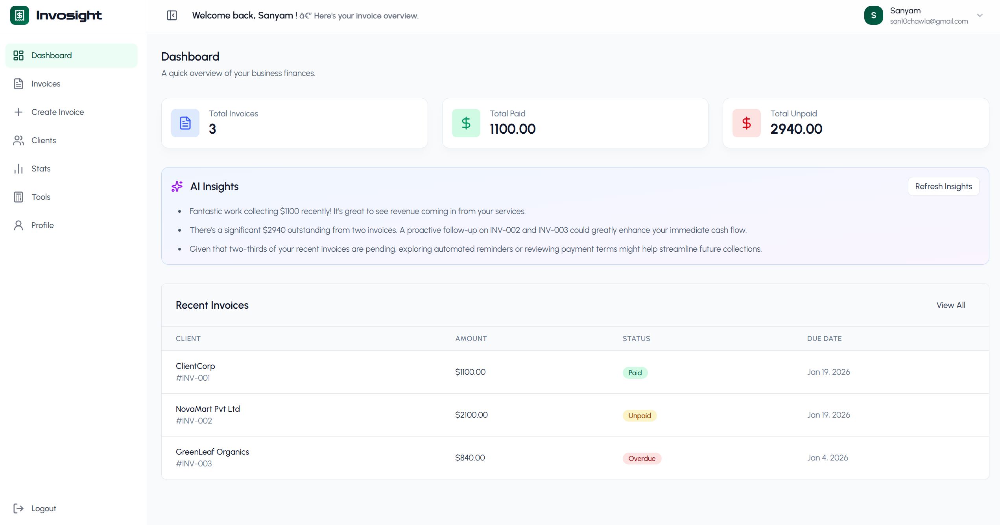
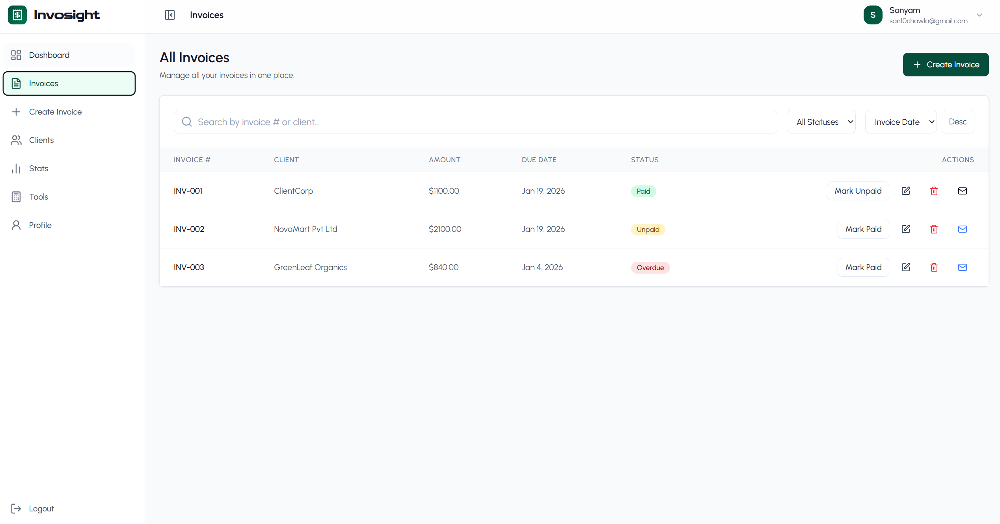
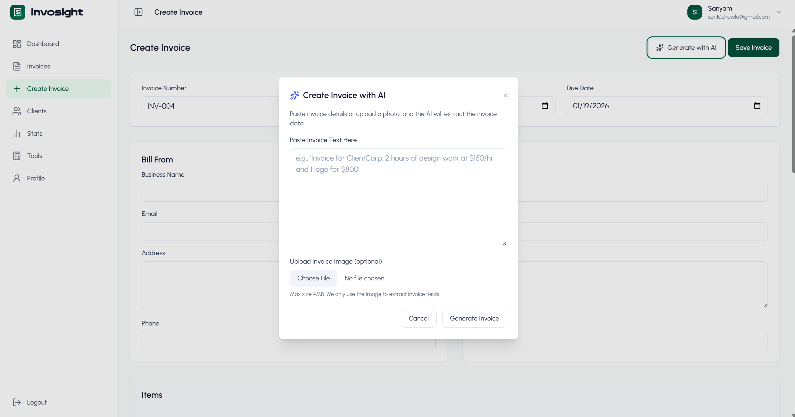
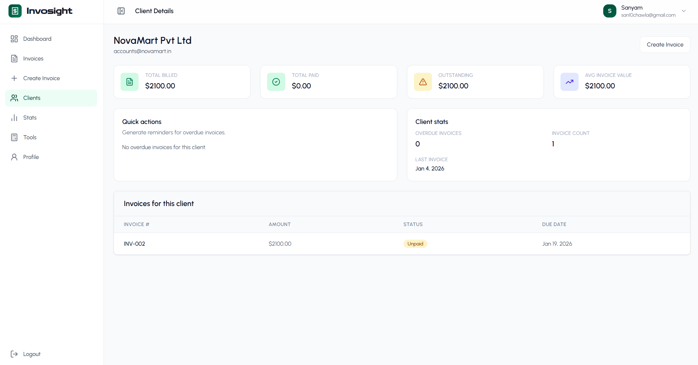
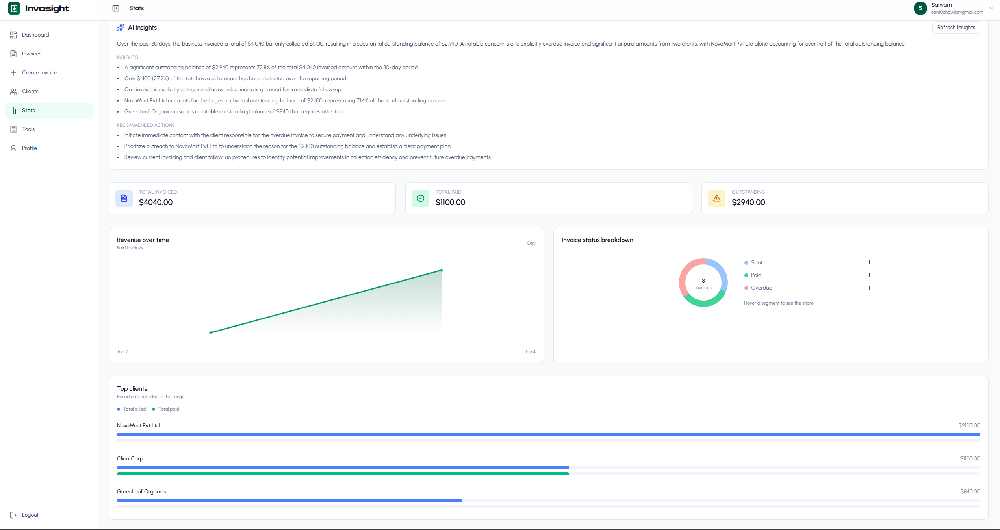
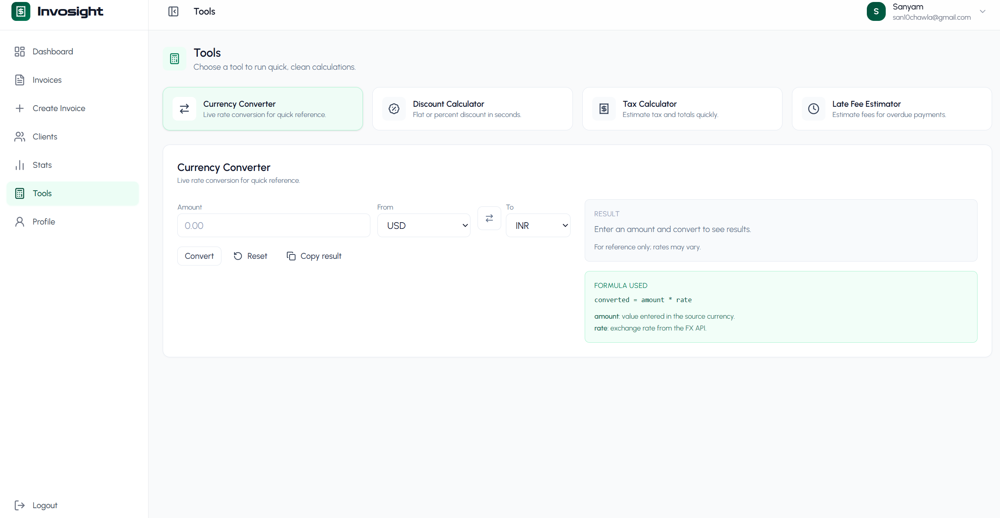

# Invosight
AI-powered invoicing and finance assistant (MERN + Gemini).

Invosight helps freelancers and small businesses create invoices quickly, share client links, send smart reminders, and track revenue with lightweight AI insights and tools.

## Table of Contents
- [Overview](#overview)
- [Folder Structure](#folder-structure)
- [Live Demo](#live-demo)
- [Screenshots](#screenshots)
- [Features](#features)
- [Tech Stack](#tech-stack)
- [Design Principles and Code Quality](#design-principles-and-code-quality)
- [Setup](#setup)
  - [Prerequisites](#prerequisites)
  - [Backend Setup](#backend-setup)
  - [Frontend Setup](#frontend-setup)
- [Build](#build)
- [Running Tests](#running-tests)
- [Tests List](#tests-list)

## Overview
- Generate invoices from text or receipt images using Gemini.
- Share read-only client links and generate payment reminders on demand.
- Track clients, overdue balances, and revenue trends.
- Use quick tools for currency, discount, tax, and late-fee estimates.

## Folder Structure
```
Invosight/
|-- backend/                  # Express + MongoDB API
|   |-- config/               # DB connection config
|   |-- controllers/          # Route handlers (auth, invoices, stats, AI)
|   |-- middlewares/          # Auth, error, rate-limit middleware
|   |-- models/               # Mongoose models (User, Invoice)
|   |-- routes/               # API routes (auth, invoices, stats, AI)
|   |-- tests/                # Backend Jest + Supertest tests
|   |-- utils/                # Shared logic (totals, due dates, share token)
|   |-- server.js             # Express app entry point
|   |-- package.json          # Backend deps + scripts
|   `-- .env                  # Backend env vars (ignored in git)
|-- frontend/                 # React (Vite) client
|   |-- public/               # Static assets
|   |-- src/
|   |   |-- api/              # API layer wrappers (axios calls)
|   |   |-- assets/           # Images/icons
|   |   |-- components/       # Reusable UI components
|   |   |-- constants/        # Shared constants (statuses, options)
|   |   |-- context/          # Auth context/state
|   |   |-- pages/            # Route pages (Dashboard, Invoices, Clients, Stats)
|   |   |-- utils/            # Helpers (formatting, axios instance, paths)
|   |   |-- App.jsx           # App routes + layout
|   |   `-- main.jsx          # React entry point
|   |-- test/                 # Frontend Jest tests
|   |-- index.html            # Vite HTML template
|   |-- vite.config.js        # Vite config
|   |-- jest.config.cjs       # Frontend Jest config
|   `-- .env                  # Frontend env vars (ignored in git)
|-- screenshots/              # README images
|-- README.md                 # Project documentation
`-- .gitignore                # Git ignore rules
```

## Live Demo
- Coming soon!

## Screenshots
- Dashboard
  - 
- Invoices
  - 
- AI Invoice Generation
  - 
- Clients
  - 
- Stats
  - 
- Tools
  - 

## Features
### Authentication and Profile
- Sign up, log in, log out
- JWT auth via httpOnly cookies
- Profile details used to prefill invoices

### Invoices
- Create, edit, delete invoices
- Automatic totals (subtotal, tax, total)
- Due date auto-derived from payment terms
- Status: Paid / Unpaid (Overdue derived in stats)
- Print-friendly invoice view
- Download invoice as PDF

### AI
- Parse invoice text into structured fields
- Parse receipt images into structured fields
- Generate payment reminders with tone (polite, firm, final)
- Dashboard and stats insights generated on demand

### Sharing
- Shareable client view link: `/share/<token>`
- Optional disable share link

### Clients
- Aggregated client list (total billed, outstanding, overdue count, last invoice)
- Client detail view with invoice history and quick actions

### Stats
- Revenue over time (day/week/month)
- Status breakdown (Sent, Paid, Overdue)
- Top clients

### Tools
- Currency converter (reference only)
- Discount calculator
- Tax calculator
- Late fee estimator

### Security and Reliability
- Upstash rate limiting on auth and AI routes
- Server-side validation and normalized calculations

## Tech Stack
- Frontend: React (Vite), Tailwind CSS, Axios
- Backend: Node.js, Express, MongoDB (Mongoose)
- AI: Google Gemini (`@google/genai`)
- Testing: Jest + Supertest

## Design Principles and Code Quality
- Modular structure: controllers/routes/models on backend, pages/components/utils on frontend.
- Reusability first: shared UI components, formatting utils, and API helpers.
- Thin controllers: shared invoice logic extracted to utils.
- Consistent naming: PascalCase components, camelCase helpers.
- Minimal complexity: clear, testable functions over heavy abstractions.
- OOP where it fits (Mongoose models), otherwise functional React components.

## Setup
### Prerequisites
- Node.js 18+ and npm
- MongoDB connection string
- Gemini API key
- (Optional) Upstash Redis for rate limiting

### Backend Setup
```bash
cd backend
npm install
```

Create `backend/.env`:
```env
MONGO_URI=your_mongodb_connection_string
JWT_SECRET=your_jwt_secret
SHARE_TOKEN_SECRET=optional_share_secret
SHARE_TOKEN_TTL=7d
GEMINI_API_KEY=your_gemini_api_key
GEMINI_MODEL=models/gemini-2.5-flash
PORT=8000
CORS_ORIGIN=http://localhost:5173
UPSTASH_REDIS_REST_URL=optional_upstash_url
UPSTASH_REDIS_REST_TOKEN=optional_upstash_token
RATE_LIMIT_AUTH_MAX=20
RATE_LIMIT_AUTH_WINDOW="15 m"
RATE_LIMIT_AI_MAX=30
RATE_LIMIT_AI_WINDOW="1 h"
```

Run backend:
```bash
npm run dev
```

### Frontend Setup
```bash
cd frontend
npm install
npm run dev
```

Optional `frontend/.env`:
```env
VITE_API_BASE_URL=http://localhost:8000
```

Visit: http://localhost:5173

## Build
Frontend production build:
```bash
cd frontend
npm run build
```

Preview build:
```bash
npm run preview
```

Backend production run:
```bash
cd backend
npm start
```

## Running Tests
Backend tests:
```bash
cd backend
npm test
```

Frontend tests:
```bash
cd frontend
npm test
```

## Tests List
Backend
- Login with missing email/password returns 400/401.
- Register and login set auth cookie.
- Wrong password returns 401.
- Create invoice then list returns it; totals are correct.
- Due date auto-derived from payment terms.
- Other user cannot fetch invoice.
- Share token returns invoice; expired token rejected.
- AI parse (text) returns structured JSON (mocked Gemini).
- AI parse (image) returns structured JSON (mocked Gemini).
- AI parse (text) missing input returns 400.
- AI reminder returns reminder text and uses tone (mocked Gemini).
- Stats returns revenue series and status breakdown.

Frontend
- Header shows brand + Login/Sign Up when logged out.
- Login renders email/password/submit.
- Login shows validation errors for invalid email and short password.
- Sign Up renders name/email/password/confirm/submit.
- Hero shows image and correct CTA based on auth state.
- Create Invoice totals update when qty/price/tax change.
- AI modal shows validation error when empty.
- Clients page renders aggregated client rows.
- Tools discount calculator computes discount and final amount.
